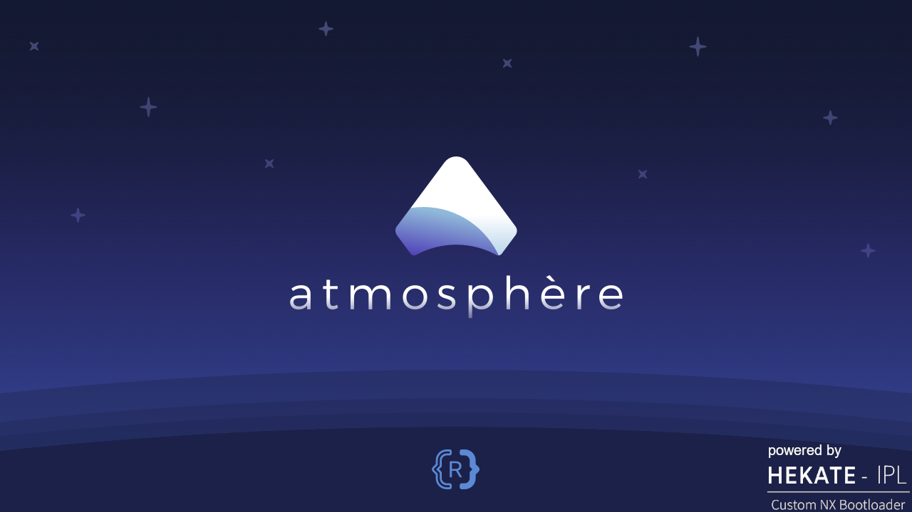

<h1 align="center">GMPACK - Pacote Atmosphère GameMod</h1>

GMPACK é um pacote de custom firmware que inclui o Atmosphère, sigpatches, hekate, nyx e vários outros homebrews.

## **[FAÇA O DOWNLOAD POR AQUI!](https://github.com/coldmvm/gmpack/releases)**

## Como instalar
- Formate seu microSD em FAT32 e descompacte o conteúdo do arquivo .zip na raiz.
  - O processo de instalação deste pacote fica mais fácil quando é feito pelo homebrew [APG - Atualizador Pacote GameMod](https://github.com/coldmvm/gmpack-updater).

## Disclaimer
A GameMod design não detém nenhum direito de cópia sobre nenhum arquivo baixado por este homebrew e todo o crédito pertence aos seus respectivos proprietários. Se o atual proprietário dos arquivos contidos neste repositório solicitar, os removeremos imediatamente.

## Agradecimentos especiais
- [atmosphere-NX](https://github.com/atmosphere-NX/Atmosphere/) pelo Atmosphère.
- [CTCaer](https://github.com/CTCaer/hekate/) pelo Hekate e Nyx.
- Todos os outros desenvolvedores que contribuem para a cena Switch.

## 📝 Licença

O nome Nintendo Switch e logo são marcas registradas de [Nintendo](https://github.com/Nintendo). Este repositório ñão é afiliado a [Nintendo](https://github.com/Nintendo) ou nenhum dos seus parceiros.

The Nintendo Switch names and logos are a trademark of [Nintendo](https://github.com/Nintendo). This repository is in no way affiliated with [Nintendo](https://github.com/Nintendo) or any of its partners.
